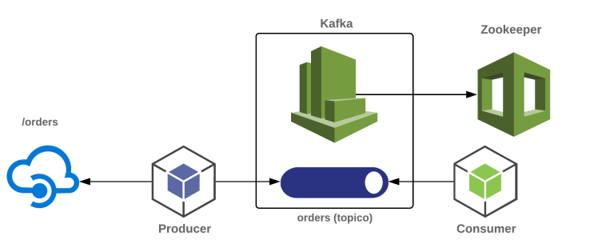

# ProducerKafkaSeed
Apache Kafka + Kafdrop + Docker Compose

# Requirements
Através do uso de um único arquivo YAML do Docker Compose serão criadas instâncias de um broker Kafka, do ZooKeeper (um dos componentes fundamentais de um ambiente Kafka) e do Kafdrop (projeto Web open source que permite visualizar informações de brokers Kafka como tópicos existentes, consumers e até mesmo o conteúdo de mensagens enviadas a um tópico

O comando docker-compose up -d deve ser utilizado para rodar o arquivo "Docker-compose.yaml" onde criará a network e os containers esperados, realizando inclusive o download das imagens se as mesmas ainda não existirem na máquina considerada.

Para mais informações para apreparar o ambiente acessar:  https://medium.com/azure-na-pratica/apache-kafka-kafdrop-docker-compose-montando-rapidamente-um-ambiente-para-testes-606cc76aa66

O ProducerKafkaSeed serve como Producer para o projeto https://github.com/ViniciusMargotti/ConsumerKafkaSeed.

